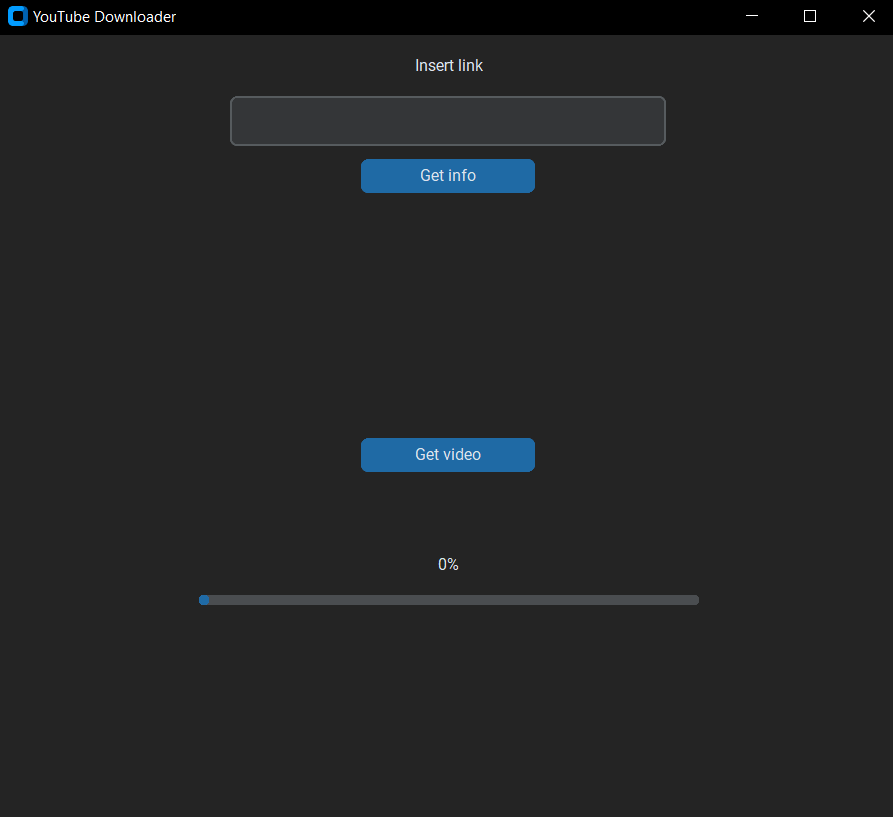
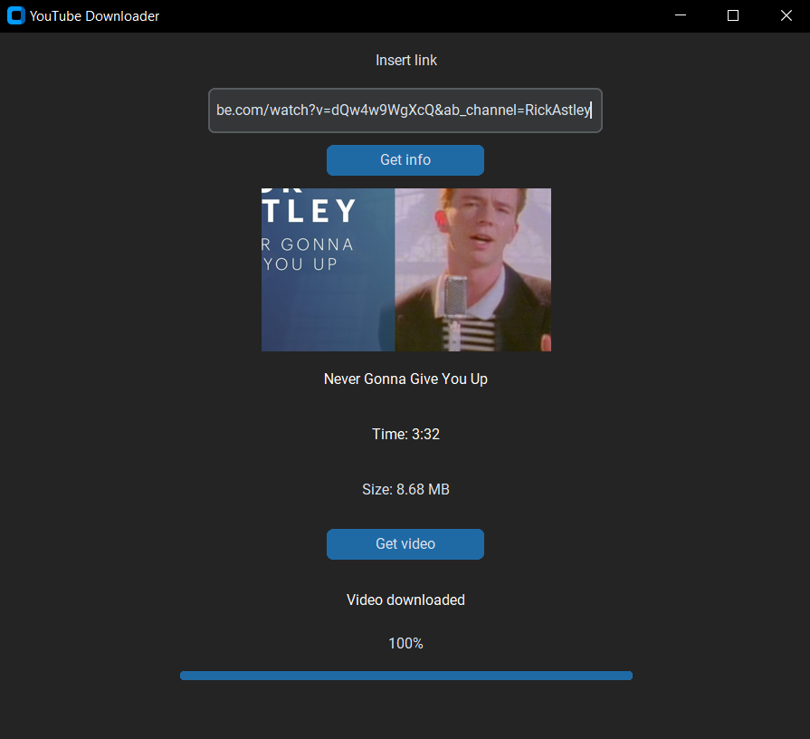

# Python YouTube Downloader

### About
Python YouTube Downloader is an application with GUI made with TKinter. This application helps to download a video file from YouTube using video's URL link.

### Needed tools
- Python version min 3.9

### How to run
1. Open project in IDE
2. Remember to download needed packages such as **`TKinter`** or **`PyTube`**
3. Run the project

### Functionalities
- Inserting URL
- Getting video information - time, size, title, author
- Download the video

## Screenshots

### Main panel

### Video information

### Downloading the video

